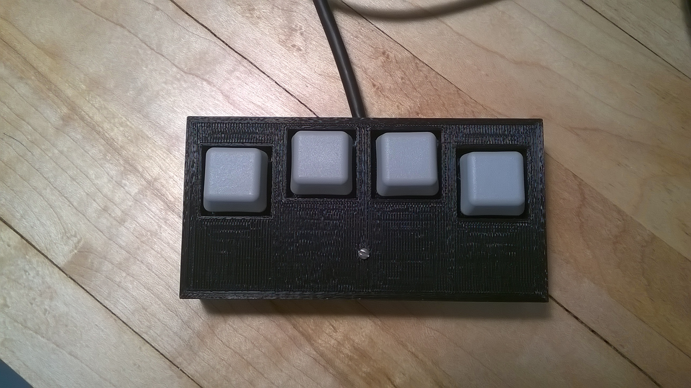
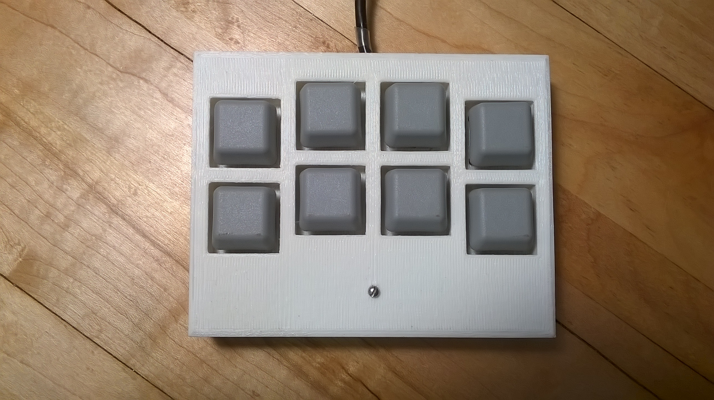
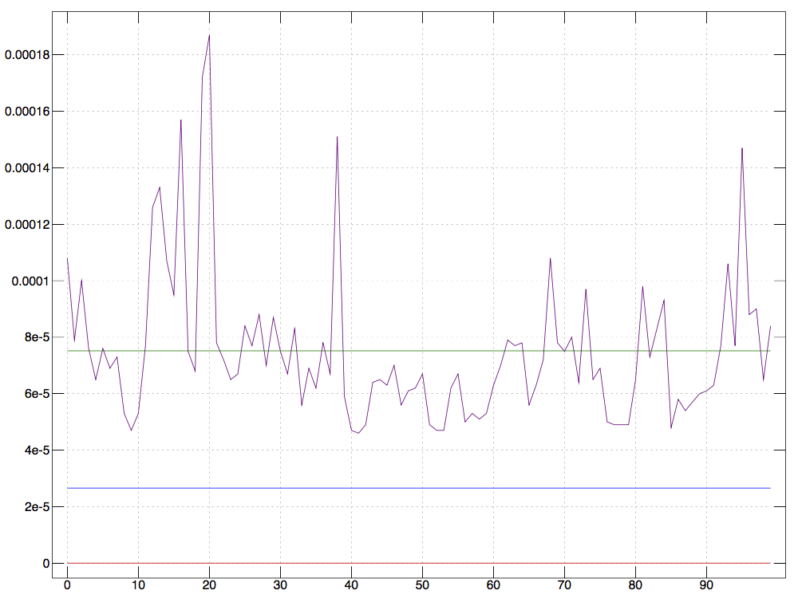

Psych-Button
============
USB response boxes with real-time accuracy.

Many times in psychological experiments, researchers wish to record button presses with accurate timing.  Operating system timing resolution may be inadequate, so out-of-band timing channels are required.

This project centers around a USB keyboard with the added ability to accurately characterize the delay of its system.

# Keyboard Quick Start
To use as a USB keyboard, plug-and-play.  The default keys are:

* Four-button version (left-to-right)

  * Top row: <kbd>w</kbd> <kbd>x</kbd> <kbd>y</kbd> <kbd>z</kbd>
  * Metal: <kbd>_</kbd>

* Eight-button version (left-to-right)

  * Top row: <kbd>a</kbd> <kbd>b</kbd> <kbd>c</kbd> <kbd>d</kbd>
  * Middle row: <kbd>e</kbd> <kbd>f</kbd> <kbd>g</kbd> <kbd>h</kbd>
  * Metal: <kbd>_</kbd>

> Note: if the home key (the metal pin near the center-bottom of the response box) is held, subsequent key presses will be shifted, e.g. 'a' will become 'A'.

### Timing Measurements
Round-trip delay `d` is calculated as per the [SNTP protocol, section 5](https://tools.ietf.org/html/rfc4330#section-5):

    Timestamp Name          ID   When Generated
    ------------------------------------------------------------
    Originate Timestamp     T1   time request sent by client
    Receive Timestamp       T2   time request received by server
    Transmit Timestamp      T3   time reply sent by server
    Destination Timestamp   T4   time reply received by client

    The roundtrip delay d and system clock offset t are defined as:

    d = (T4 - T1) - (T3 - T2)     t = ((T2 - T1) + (T3 - T4)) / 2.

Timing measurement from `psych-button` uses a modified version of SNTP, where `psych-button` responds to a timing request with a single number that corresponds to T3-T2.  In this scheme, T2 is always 0.  T3 is measured in integer microseconds.  Offset is not used, because `psych-button` doesn't keep a wall clock time.  The only figure we're interested in is the round-trip delay.

This procedure is done at least once, usually before an experiment, but can be done at any point in time except during data collection.

    PC (note system time T1), send character: 'T'
    psych-button: T3
    PC (note time of reply T4, calculate d given T3, T2=0)

### Python pyserial example

    cd examples/
    python pythonExample.py

The results from this test is a list of 100 numbers, corresponding to timing measurements before (t1) sending a `T` and after (t2).  The plot below (generated by [this script](images/stats.ijs), written in [J](http://www.jsoftware.com/)) shows the results of one such test, highlighting the standard deviation (blue), variance (red), arithmetic mean (green) and differences (t2i - t1i, violet):

Usage (Keyboard)
----------------
The Keyboard interface sends a `keydown` event when a button is pressed, or a `keyup` event when it is released.

The Keyboard interface is plug and play.  By default, the 4 (or 8) buttons correspond to <kbd>w</kbd>, <kbd>x</kbd>, <kbd>y</kbd>, and <kbd>z</kbd> keyboard events.  The "home" button prints a `_` (underbar).  Open a text editor and use the response box to "type" letters.

| button | key          |
|--------|:------------:|
| 0      | <kbd>w</kbd> |
| 1      | <kbd>x</kbd> |
| 2      | <kbd>y</kbd> |
| 3      | <kbd>z</kbd> |

> Note: the 8-button box has the default alphabet `abcdefgh`

Usage (Serial)
--------------
When any button changes, the Serial interface responds by printing the state of all the buttons on a single line.

To use the serial interface, open a serial terminal on your computer using a program such as [pyserial](https://github.com/pyserial/pyserial).  Use the following settings:

* 9600 baud
* 8 data bits
* no parity
* 1 stop bit

Pressing and holding the `b0` button (and no others) will result in one line of output:

    1 0 0 0 0

Meanwhile, if you press the `b3` button, while continuing to hold `b0`, the next output will be:

    1 0 0 1 0

Finally, releasing the `b3` button, then releasing the `b0` button, will produce this output:

    0 0 0 1 0
    0 0 0 0 0

The eight-button box is similar:

    0 0 0 0 0 0 0 0 0
    0 1 0 0 0 0 0 0 0

> Note: the "home" button is the last value.

Notes
-----
Source code built with [platformio](http://platformio.org/#!/), a cross-platform command-line based build tool and dependency manager.

Related Reading
---------------
* [example Python serial application](http://eli.thegreenplace.net/2009/08/07/a-live-data-monitor-with-python-pyqt-and-pyserial/)
* [NTP overview](https://en.wikipedia.org/wiki/Network_Time_Protocol#Clock_synchronization_algorithm)
* [Synchronization Explained](http://www.ni.com/white-paper/11369/en/)
* [Precision Time Protocol](https://en.wikipedia.org/wiki/Precision_Time_Protocol)
